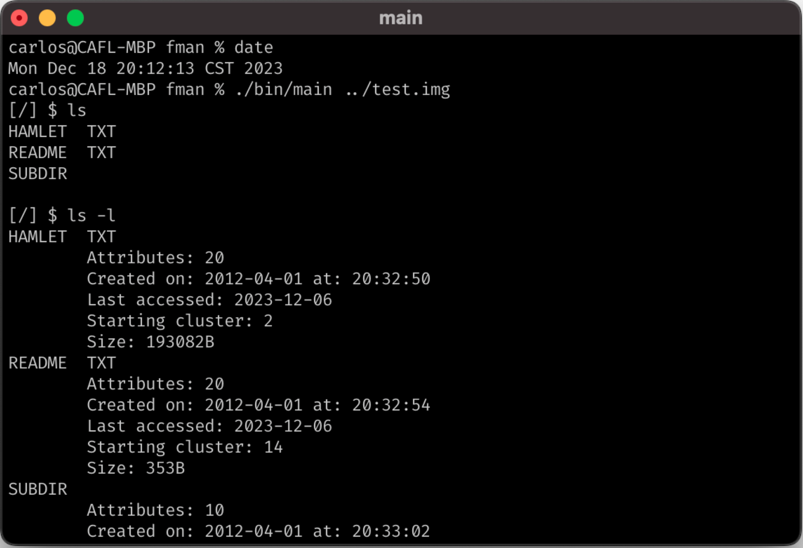
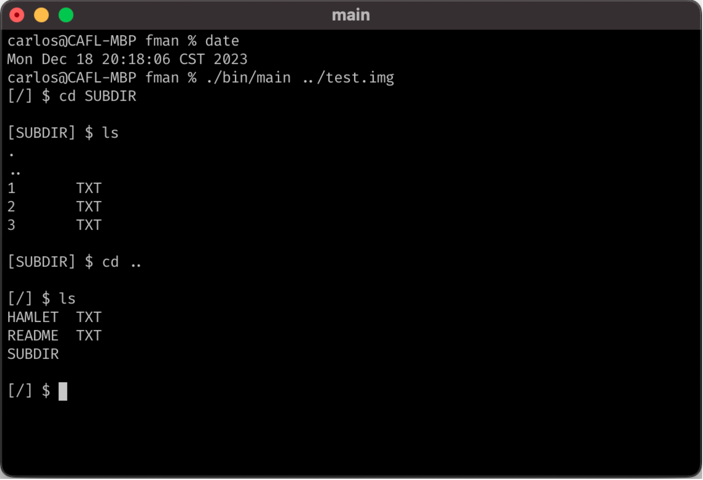
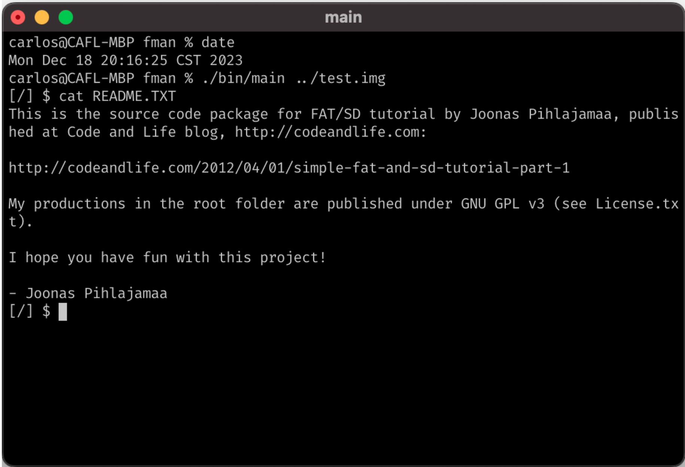
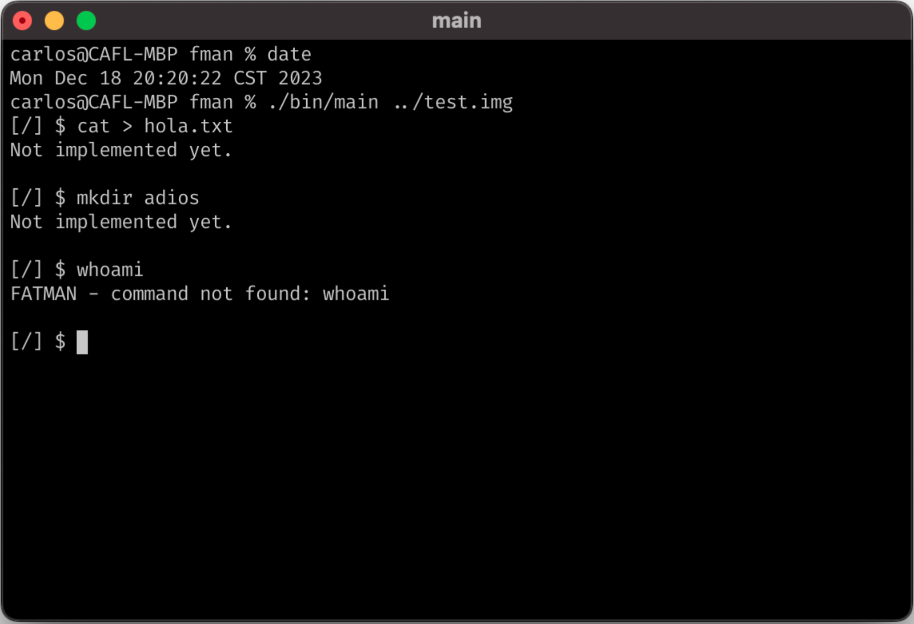

# FATMAN

## Operating Systems II course's main project

## Index

- General Information
- Installation
- Usage
- Commands
    - ls
    - cat
    - cd
    - mkdir
    - touch
- Future Plans
- Sources
- Gallery

# General Information

FATMAN (**FAT Man**ager) is my Operating Systems II course's main project. It consisted in the development of a (mini) shell that lets you interact with a FAT16 filesystem inside a disk image.

The project was developed between 21/11/23 - 18/12/23.

# Installation
To install FATMAN in your computer run the following commands:

```bash
$ git clone https://github.com/Cafortinl/FATMAN.git
$ cd FATMAN
```

To compile the project in unix/linux based operating systems run the following:

```bash
$ make
```

# Usage
To run the program run the following:

```bash
$ ./bin/main path_to_disk_image
```

For example

```bash
$ ./bin/main ./test.img
```

# Commands

The shell needed to have the following commands*:

## ls

Lists the files in the current directory. When the `-l` flag is active it shows the file's metadata.

This command was fully implemented.

### Example
```bash
[/] $ ls
HAMLET TXT
README TXT
SUBDIR
```

## cat

Concatenates and prints files.

The printing part of this command was implemented.

### Example
```bash
[/] $ cat TEST.TXT
This is a test file.
```

## cd

Changes current working directory.

This command was fully implemented.

### Example
```bash
[/] $ cd SUBDIR
[SUBDIR] $
```

## mkdir

Creates a directory.

Incomplete command.

### Example
```bash
[/] $ mkdir DIRB
[/] $ ls
HAMLET TXT
README TXT
DIRB
SUBDIR
```

## touch

Changes file access or modification times.

Incomplete command.


* The commands are not a 1:1 clone of the unix utilities with the same name.

# Future Plans

Even though this project was already turned in and graded I want to complete it in my free time.

The current `to do` list is:
- [ ] Finish the directory entry creation to implement `mkdir`.
- [ ] Finish the file creation/modification to implemente both `cat` and `touch`.
- [ ] Add support for long file name entries.

# Sources

Info about the FAT file system found in:
- <https://wiki.osdev.org/FAT>
- <https://www.compuphase.com/mbr_fat.htm>
- <https://codeandlife.com/2012/04/02/simple-fat-and-sd-tutorial-part-1/>
- <http://www.tavi.co.uk/phobos/fat.html>

# Gallery





